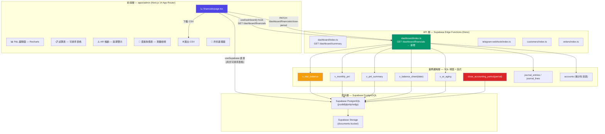
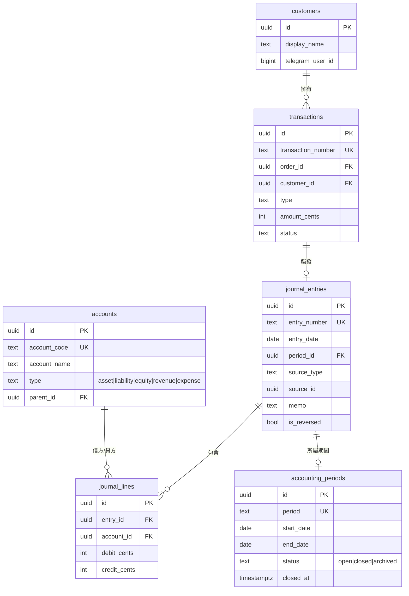
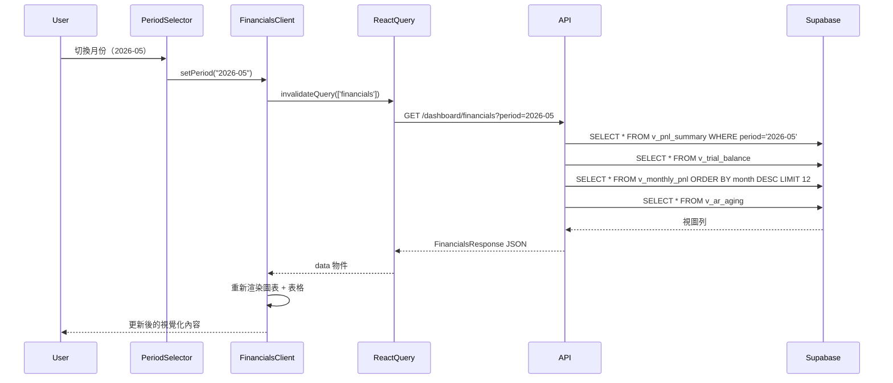

# 買手對象系統 — 財務報表儀表板增強
## 實作計劃

| 欄位 | 內容 |
|---|---|
| **Epic** | BuyerOS（買手對象系統） |
| **功能** | 財務報表儀表板增強 |
| **狀態** | 準備實作 |
| **日期** | 2026-05-23 |
| **負責人** | AI Agent |
| **影響範圍** | `apps/admin` + `supabase/functions/dashboard` |

---

## 1. 目標

將目前 `apps/admin/app/financials/page.tsx` 中以靜態 mock SVG 模擬的圖表和試算表，替換為直接查詢 Supabase PostgreSQL 會計視圖（`v_trial_balance`、`v_monthly_pnl`、`v_pnl_summary`、`v_balance_sheet`、`v_ar_aging`）的真實資料驅動視覺化元件。目標是為管理員提供一個即時、互動的財務指揮中心——包含月趨勢 P&L 圖、按類別分類的收入/支出分布、可排序的試算表，以及 AR 帳齡警示——全部由 migration `0002_accounting_layer.sql` 及 `0002b_config_driven_posting.sql` 已實作的複式記帳層驅動。

---

## 2. 需求

### 2.1 核心需求

- [ ] **即時 P&L 趨勢圖**：以 `v_monthly_pnl` 的近 12 個月真實資料取代 mock 6 個月柱狀圖。每月收入（綠）和支出（紅）並排顯示。
- [ ] **類別分布圖（圓餅/樹圖）**：使用 `v_pnl_summary` 顯示選定期間內，按科目名稱分類的收入與支出分布。
- [ ] **互動試算表**：將靜態表格替換為可排序、可篩選的表格。餘額著色（正數綠/負數紅）區分借方貸方。
- [ ] **AR 帳齡模組**：查詢 `v_ar_aging`，將逾期應收款以 0–30 / 31–60 / 61–90 / 90+ 天分組顯示，含客戶名稱和訂單連結。
- [ ] **資產負債表快照**：新增「資產負債表」頁籤，以 `v_balance_sheet(date)` 驅動，選定日期的資產、負債及權益。
- [ ] **期間選擇器**：全局月份選擇器（YYYY-MM），連動頁面所有圖表和表格。
- [ ] **月結按鈕**：管理員可透過按鈕觸發 `close_accounting_period(period)`，附確認對話框和樂觀更新 UI。
- [ ] **匯出 CSV**：支援下載當期 P&L 明細及試算表 CSV 檔。
- [ ] **載入/空值/錯誤狀態**：每個非同步區塊都有 loading 骨架、空值插圖和 API 錯誤橫幅處理。

### 2.2 實作規格

- [ ] 新增 `GET /functions/v1/dashboard/financials` Edge Function，單次呼叫彙總所有財務視圖（減少網路往返）。
- [ ] 重構 `apps/admin/app/financials/page.tsx` 為組合式子元件架構。
- [ ] 為所有財務視圖的行型別新增 TypeScript 介面。
- [ ] 以圖表庫（Recharts — 已在 Next.js 生態，支援 tree-shaking）取代 mock SVG 柱狀圖。
- [ ] 確認 `v_ar_aging` 視圖已存在於 migration `0002_accounting_layer.sql`，若無則新增。
- [ ] 確認 `v_balance_sheet(date)` 的參數型別及 Supabase 綁定方式。
- [ ] 確認 `journal_entries` 表有資料時，所有視圖均能正常回傳結果（seed 資料必須存在）。

---

## 3. 技術考量

### 3.1 系統架構總覽



#### 3.1.1 技術棧選擇

| 層 | 技術 | 理由 |
|---|---|---|
| **前端框架** | Next.js 14 App Router | 已在使用，React Server Components 做初始資料抓取，Client Components 處理互動 |
| **圖表** | Recharts 2.x | 支援 tree-shaking、React 原生、響應式 SVG、TypeScript 支援佳 |
| **狀態管理** | React Query (`@tanstack/react-query`) | 與 Supabase 配合，支援快取失效、分頁、載入狀態 |
| **API 層** | Supabase Edge Functions (Deno) | 已在部署，service_role key 做管理員專屬呼叫，回傳 JSON |
| **資料庫視圖** | PostgreSQL 一般視圖 | `v_trial_balance`、`v_monthly_pnl`、`v_pnl_summary`、`v_balance_sheet`、`v_ar_aging` |
| **樣式** | CSS 自訂屬性 + 現有 `globals.css` | 專案無 Tailwind 依賴；擴展現有設計系統 |
| **圖示** | Lucide React | 輕量、筆觸一致的圖示，符合 shadcn/ui 美學 |

#### 3.1.2 整合點

| 整合 | 協定 | 說明 |
|---|---|---|
| Admin → Edge Function | REST（經 `lib/api.ts`） | `GET /dashboard/financials?period=YYYY-MM` |
| Edge Function → PostgreSQL 視圖 | Supabase JS client（`@supabase/supabase-js`） | service_role key 供管理員存取 |
| 圖表元件 → API 資料 | React props / React Query | Server Component 抓資料，傳遞給 Client 圖表元件 |
| 月結動作 | Edge Function `PATCH /dashboard/financials/close-period` | 觸發 `close_accounting_period(period)` SQL 函式 |
| CSV 匯出 | 客戶端 Blob 生成 | 不需要伺服器往返 |

#### 3.1.3 部署架構

```
apps/admin/         → Vercel（或 npm run build → npm start 於 DigitalOcean VPS）
supabase/functions/ → Supabase Cloud Edge Functions
資料庫              → Supabase PostgreSQL managed DB
```

本功能不需要額外的 Docker 容器。

#### 3.1.4 擴展性考量

- **水平擴展**：Edge Functions 在 Supabase 邊緣網路自動擴展。
- **查詢效能**：所有財務視圖均使用索引的 `entry_date` 和 `account_code` 欄位；無 N+1 問題。
- **快取**：React Query 財務查詢加入 `staleTime: 60_000`，避免重複呼叫 Supabase。
- **大資料集**：若 `journal_lines` 超過 100 萬行，考慮對近期期間新增部分索引：
  `CREATE INDEX idx_jl_recent ON journal_lines(entry_id) WHERE entry_date > NOW() - INTERVAL '2 years'`

---

### 3.2 資料庫結構設計

財務視圖已定義於 `supabase/migrations/0002_accounting_layer.sql`。以下實體關聯圖說明驅動儀表板的資料模型。



#### 3.2.1 視圖規格

所有資料表已存在於 migrations `0001`–`0005`。關鍵財務視圖：

| 視圖 / 函式 | 輸入 | 輸出 | 使用者 |
|---|---|---|---|
| `v_trial_balance` | — | 所有科目之借方/貸方合計 | 試算表頁籤 |
| `v_monthly_pnl` | — | 月度收入/支出細項 | P&L 趨勢圖 |
| `v_pnl_summary` | `period = 'YYYY-MM'` | 收入/支出/淨利潤 列 | P&L 摘要卡片 |
| `v_balance_sheet(date)` | `date` | 指定日期之資產/負債/權益 | 資產負債表頁籤 |
| `v_ar_aging` | — | 按客戶及天數分之逾期應收款 | AR 帳齡模組 |
| `close_accounting_period(period)` | `text` | 鎖定期間並建立結帳分錄 | 月結按鈕 |

#### 3.2.2 索引策略

| 索引 | 資料表 | 欄位 | 理由 |
|---|---|---|---|
| `idx_journal_entries_entry_date` | `journal_entries` | `entry_date` | 所有視圖的期間篩選 |
| `idx_journal_lines_entry_id` | `journal_lines` | `entry_id` | JOIN 至 journal_entries |
| `idx_journal_lines_account_id` | `journal_lines` | `account_id` | JOIN 至 accounts |
| `idx_accounts_type` | `accounts` | `type` | 篩選資產/負債/收入/支出 |
| `idx_accounts_code` | `accounts` | `account_code` | UK，餘額計算使用 |
| `idx_transactions_customer_id` | `transactions` | `customer_id` | AR 帳齡計算 |
| `idx_orders_customer_status` | `orders` | `customer_id, status` | 識別未付款訂單以計算 AR |

#### 3.2.3 資料庫遷移策略

```bash
# 1. 確認 v_ar_aging 存在（如不存在則加到 0002）
# 2. 確認 v_balance_sheet(date) 在 0002 中
# 3. 以 seed.sql 載入後驗證所有視圖均有資料
npx supabase db push --file supabase/migrations/0002_accounting_layer.sql

# 4. 在 Supabase Studio 驗證視圖
SELECT * FROM v_trial_balance LIMIT 5;
SELECT * FROM v_monthly_pnl ORDER BY month DESC LIMIT 12;
SELECT * FROM v_pnl_summary WHERE period = '2026-05';
SELECT * FROM v_ar_aging;
SELECT * FROM v_balance_sheet('2026-05-31'::date);
```

---

### 3.3 API 設計

#### 3.3.1 新端點：`GET /functions/v1/dashboard/financials`

**查詢參數：**

| 參數 | 型別 | 必填 | 預設值 | 說明 |
|---|---|---|---|---|
| `period` | `string`（YYYY-MM） | 否 | 當月 | 要查詢的期間 |
| `months` | `number` | 否 | `12` | 趨勢圖顯示月數 |

**回應（TypeScript）：**

```typescript
interface FinancialsResponse {
  period: string;                    // "2026-05"
  summary: {
    totalRevenueCents: number;
    totalExpenseCents: number;
    netProfitCents: number;
  };
  trialBalance: TrialBalanceRow[];
  monthlyPnL: MonthlyPnLRow[];
  balanceSheet: BalanceSheetRow[];
  arAging: ARAgingRow[];
  periodStatus: 'open' | 'closed';
}

interface TrialBalanceRow {
  account_code: string;
  account_name: string;
  type: 'asset' | 'liability' | 'equity' | 'revenue' | 'expense';
  total_debit_cents: number;
  total_credit_cents: number;
  balance_cents: number;
}

interface MonthlyPnLRow {
  month: string;              // "2026-05"
  type: 'revenue' | 'expense';
  account_name: string;
  amount_cents: number;
}

interface BalanceSheetRow {
  account_code: string;
  account_name: string;
  type: 'asset' | 'liability' | 'equity';
  balance_cents: number;
}

interface ARAgingRow {
  customer_id: string;
  customer_name: string;
  order_id: string;
  amount_cents: number;
  days_overdue: number;
  bucket: 'current' | '30' | '60' | '90' | '90plus';
}
```

**驗證方式：** `Authorization: Bearer <ANON_KEY>`（Edge Function 內以 service_role 強制執行 RLS）。

**錯誤回應：**

| 狀態碼 | 回應主體 | 觸發條件 |
|---|---|---|
| `200` | `FinancialsResponse` | 成功 |
| `400` | `{ error: "invalid_period_format" }` | period 非 YYYY-MM 格式 |
| `500` | `{ error: "view_not_found" }` | 視圖不存在 — migration 未套用 |
| `500` | `{ error: "database_error" }` | Supabase 連線錯誤 |

#### 3.3.2 新端點：`PATCH /functions/v1/dashboard/financials/close-period`

**請求主體：**

```typescript
interface ClosePeriodRequest {
  period: string;  // "2026-05"
}
```

**回應：**

```typescript
interface ClosePeriodResponse {
  success: true;
  period: string;
  closedAt: string;          // ISO 時間戳
  closingEntryId: string;   // 結帳分錄的 journal_entries.id
}
```

**錯誤回應：**

| 狀態碼 | 回應主體 | 觸發條件 |
|---|---|---|
| `400` | `{ error: "period_already_closed" }` | 期間狀態已為 'closed' |
| `403` | `{ error: "admin_only" }` | 非管理員呼叫 |
| `500` | `{ error: "closing_entry_failed" }` | 資料庫交易失敗 |

#### 3.3.3 現有端點：`GET /functions/v1/dashboard/summary`

無變更。繼續為儀表板首頁提供頂層 KPI 卡片資料。

#### 3.3.4 速率限制

- Financials 端點：每 IP **30 req/min**（Supabase 預設速率限制）。
- 期間選擇器無需客戶端防抖（僅使用者主動操作）。

#### 3.3.5 快取策略

Edge Function 回應包含 `Cache-Control: public, max-age=60` header。React Query 設定：

```typescript
const { data } = useQuery({
  queryKey: ['financials', period],
  queryFn: () => getFinancials(period),
  staleTime: 60_000,   // 1 分鐘
  gcTime: 300_000,     // 5 分鐘
});
```

---

### 3.4 前端架構

#### 3.4.1 元件階層

```
financials/page.tsx                    ← Server Component 外殼（抓取初始期間）
└── FinancialsClient.tsx             ← 'use client' — 管理期間狀態 + React Query
    ├── PageHeader                    ← 標題 + 全域期間選擇器 + 匯出按鈕
    │   ├── PeriodSelector            ← <input type="month"> — 觸發重新抓取
    │   └── ExportCSVDropdown         ←「下載 P&L CSV」/「下載試算表 CSV」
    │
    ├── SummaryCards                 ← 收入/支出/淨利潤 統計卡片
    │   └── StatCard                 ← 圖示 + 標籤 + 格式化 HK$ 值 + 變化徽章
    │
    ├── TabNavigation                ←「P&L」|「試算表」|「資產負債表」|「AR 帳齡」
    │
    ├── TabContent                   ← 按 activeTab 條件渲染
    │   ├── PnLTab
    │   │   ├── PnLTrendChart        ← Recharts BarChart — 12 個月收入 vs 支出
    │   │   │   └── CustomTooltip    ← 游標懸停顯示格式化 HK$
    │   │   └── CategoryBreakdown    ← Recharts PieChart — 按科目顯示收入/支出
    │   │
    │   ├── TrialBalanceTab
    │   │   ├── TrialBalanceTable    ← 可排序：科目代碼、名稱、類型、借方、貸方、餘額
    │   │   │   └── TableSortHeader  ← 點擊切換 asc/desc 排序
    │   │   └── TBFilterBar          ← 按類型篩選：資產/負債/權益/收入/支出
    │   │
    │   ├── BalanceSheetTab
    │   │   ├── BalanceSheetSection  ← 資產/負債/權益 可摺疊區塊
    │   │   └── BSDatePicker         ← <input type="date"> — 呼叫 v_balance_sheet(date)
    │   │
    │   └── ARAgingTab
    │       ├── ARAgingTable         ← 客戶、訂單連結、金額、天數、帳齡徽章
    │       └── ARAgingAlertBanner   ← 90+ 逾期時顯示紅色警示橫幅
    │
    ├── PeriodCloseSection            ← 管理員限定：月結按鈕 + 確認對話框
    │   └── ClosePeriodModal
    │
    └── FinancialsSkeleton             ← 各區塊的骨架載入動畫
```

#### 3.4.2 狀態流程圖



#### 3.4.3 TypeScript 介面

```typescript
// apps/admin/lib/financials.ts

export type AccountType = 'asset' | 'liability' | 'equity' | 'revenue' | 'expense';
export type PeriodStatus = 'open' | 'closed' | 'archived';
export type ARBucket = 'current' | '30' | '60' | '90' | '90plus';

export interface TrialBalanceRow {
  account_code: string;
  account_name: string;
  type: AccountType;
  total_debit_cents: number;
  total_credit_cents: number;
  balance_cents: number;
}

export interface MonthlyPnLRow {
  month: string;
  type: 'revenue' | 'expense';
  account_name: string;
  amount_cents: number;
}

export interface PnLSummaryRow {
  period: string;
  label: 'Revenue' | 'Expenses' | 'Net Profit';
  amount_cents: number;
  sort_order: number;
}

export interface BalanceSheetRow {
  account_code: string;
  account_name: string;
  type: 'asset' | 'liability' | 'equity';
  balance_cents: number;
}

export interface ARAgingRow {
  customer_id: string;
  customer_name: string;
  order_id: string;
  amount_cents: number;
  days_overdue: number;
  bucket: ARBucket;
}

export interface FinancialsData {
  period: string;
  summary: {
    totalRevenueCents: number;
    totalExpenseCents: number;
    netProfitCents: number;
  };
  trialBalance: TrialBalanceRow[];
  monthlyPnL: MonthlyPnLRow[];
  balanceSheet: BalanceSheetRow[];
  arAging: ARAgingRow[];
  periodStatus: PeriodStatus;
}

export interface ClosePeriodResponse {
  success: boolean;
  period: string;
  closedAt: string;
  closingEntryId: string;
}
```

#### 3.4.4 共用元件規格

| 元件 | 檔案 | 說明 |
|---|---|---|
| `StatCard` | `components/StatCard.tsx` | 顯示標籤 + HK$ 值 + 選用的變化徽章；接受 `accent` 顏色屬性 |
| `DataTable` | `components/DataTable.tsx` | 通用可排序表格 — 接受 `columns`、`data`、`sortKey`、`sortDir` 屬性 |
| `PeriodBadge` | `components/PeriodBadge.tsx` | 狀態徽章：綠色=open，灰色=closed |
| `ARBucketBadge` | `components/ARBucketBadge.tsx` | AR 帳齡桶徽章：綠色=current，黃色=30，橙色=60，紅色=90+ |
| `ConfirmModal` | `components/ConfirmModal.tsx` | 通用確認對話框，含標題/內容/確認/取消 |
| `SkeletonLoader` | `components/SkeletonLoader.tsx` | 骨架載入動畫，符合 stat-card 和表格形狀 |

---

### 3.5 安全與效能

#### 3.5.1 驗證 / 授權

| 動作 | 可執行角色 |
|---|---|
| 檢視財務頁面 | Admin、Manager、Supervisor（來自 `admin_users.role`） |
| 月結（鎖定期間） | Admin、Owner 限定 |
| 檢視 AR 帳齡（客戶資料） | Admin、Manager 限定 |
| 匯出 CSV | 與檢視相同 |

**實作方式：** 客戶端傳送 `x-admin-role` header（從本地 auth context 取得）→ Edge Function 先對 `admin_users` 資料表驗證，再執行敏感操作。

#### 3.5.2 資料驗證

- `period` 參數：正規表達式 `/^\d{4}-\d{2}$/` — 在 Edge Function 入口處拒絕格式錯誤的輸入。
- 資產負債表的 `date` 參數：有效的 `YYYY-MM-DD` ISO 日期字串 — 拒絕無效日期。
- `amount_cents` 值：均以 `bigint` 回傳 — 安全 JSON 序列化（無浮點數精度損失）。

#### 3.5.3 效能優化策略

| 策略 | 說明 |
|---|---|
| **單次往返** | 新的 `GET /dashboard/financials` 在單次 Edge Function 呼叫中彙總所有視圖 |
| **React Query 快取** | `staleTime: 60_000` — 切換頁籤時避免重複抓取 |
| **Server Component 預取** | `financials/page.tsx`（Server Component）在渲染時預取初始期間資料 |
| **期間選擇器防抖** | `<input type="month">` 加入 300ms 防抖，避免快速重複觸發 |
| **分頁** | 試算表：客戶端排序 + 超過 100 列時使用虛擬滾動 |
| **PostgreSQL 連線池** | Edge Functions 複用 Supabase client — 無每請求連線開銷 |

#### 3.5.4 快取機制

| 快取 | TTL | 失效觸發 |
|---|---|---|
| Edge Function 回應 | 60 秒 | 透過「重新整理」按鈕手動失效 |
| React Query `financials` 查詢 | 60s stale，5min GC | 月結後 `invalidateQueries(['financials'])` |
| 試算表排序 | 記憶體 | 不需持久化 |

---

## 4. 檔案結構

```
apps/admin/
├── app/
│   ├── financials/
│   │   ├── page.tsx                    ← Server Component 外殼
│   │   └── FinancialsClient.tsx        ← 'use client' 根元件（新建）
│   ├── page.tsx                        ← 儀表板首頁
│   └── layout.tsx
├── components/
│   ├── Sidebar.tsx
│   ├── StatCard.tsx                    ←（新建）可重用統計卡片
│   ├── DataTable.tsx                   ←（新建）可排序通用表格
│   ├── PeriodBadge.tsx                 ←（新建）open/closed 狀態徽章
│   ├── ARBucketBadge.tsx               ←（新建）AR 帳齡桶徽章
│   ├── ConfirmModal.tsx                ←（新建）確認對話框
│   └── SkeletonLoader.tsx              ←（新建）骨架載入動畫
├── lib/
│   ├── supabase.ts
│   ├── api.ts                          ← 擴展：新增 getFinancials() + closePeriod()
│   └── financials.ts                   ←（新建）TypeScript 介面 + 格式化工具

supabase/functions/
├── dashboard/
│   └── index.ts                        ← 擴展：新增 GET financials + PATCH close-period
└── _shared/
    └── index.ts

supabase/migrations/
├── 0002_accounting_layer.sql          ← 確認 v_ar_aging + v_balance_sheet 存在
└── seed.sql                          ← 確認 COA + 範例分錄資料已存在
```

---

## 5. 實作順序

### 步驟 1：API 層（Edge Function）— 約 1 小時

1. 在 `supabase/functions/dashboard/index.ts` 新增 `GET /dashboard/financials` 處理常式
2. 新增 `PATCH /dashboard/financials/close-period` 處理常式
3. 為視圖缺失情境新增完整錯誤處理
4. 在 Supabase Studio 測試：執行所有視圖查詢並確認有資料

### 步驟 2：TypeScript 介面 — 約 15 分鐘

5. 建立 `apps/admin/lib/financials.ts`，包含所有介面
6. 在 `apps/admin/lib/api.ts` 新增 `getFinancials(period)` 和 `closePeriod(period)`

### 步驟 3：共用元件 — 約 1 小時

7. 建立 `StatCard.tsx`、`DataTable.tsx`、`PeriodBadge.tsx`、`ARBucketBadge.tsx`、`ConfirmModal.tsx`、`SkeletonLoader.tsx`
8. 確保所有元件符合現有 `globals.css` 設計 token

### 步驟 4：財務頁面重構 — 約 2 小時

9. 重構 `financials/page.tsx` 為 Server Component（保留 metadata + 從 URL 取期間）
10. 建立 `FinancialsClient.tsx`：含頁籤狀態、期間狀態、React Query
11. 建立 `PnLTab`：含 `PnLTrendChart`（Recharts）+ `CategoryBreakdown`（Recharts PieChart）
12. 建立 `TrialBalanceTab`：含可排序 `DataTable` + 類型篩選器
13. 建立 `BalanceSheetTab`：含可摺疊區塊
14. 建立 `ARAgingTab`：含 `ARBucketBadge` + 警示橫幅
15. 建立 `PageHeader`：含 `PeriodSelector` + `ExportCSVDropdown`

### 步驟 5：月結功能 — 約 1 小時

16. 連接 `ClosePeriodModal` → `PATCH /dashboard/financials/close-period`
17. 樂觀 UI：顯示「結帳中...」狀態，成功後刷新資料

### 步驟 6：測試與優化 — 約 1 小時

18. 為所有區塊加入骨架載入動畫
19. 以 Supabase Studio seed 資料測試 — 確認所有圖表渲染真實數字
20. 測試錯誤狀態（無資料、migration 未套用）
21. 測試 CSV 匯出（瀏覽器開啟，驗證中文 UTF-8 BOM）
22. 執行 `npm run build` — 確認零 TypeScript 錯誤

---

## 6. 驗證指令

```bash
# 1. 驗證所有財務視圖存在且有資料
npx supabase functions serve dashboard --env-file .env.local
# 然後：curl http://localhost:54321/functions/v1/dashboard/financials?period=2026-05

# 2. 在 Supabase Studio 檢查
SELECT * FROM v_trial_balance;
SELECT * FROM v_monthly_pnl ORDER BY month DESC LIMIT 12;
SELECT * FROM v_pnl_summary WHERE period = '2026-05';
SELECT * FROM v_balance_sheet('2026-05-31'::date);
SELECT * FROM v_ar_aging;

# 3. 確認 COA 已植入
SELECT COUNT(*) FROM accounts;  -- 應有 23 列

# 4. 確認分錄資料存在（圖表有資料的前提）
SELECT COUNT(*) FROM journal_entries;

# 5. 驗證月結功能
SELECT close_accounting_period('2026-05');
SELECT status FROM accounting_periods WHERE period = '2026-05';  -- 應為 'closed'

# 6. 建置 admin 應用
cd apps/admin && npm run build
# 預期：零 TypeScript 錯誤
```
