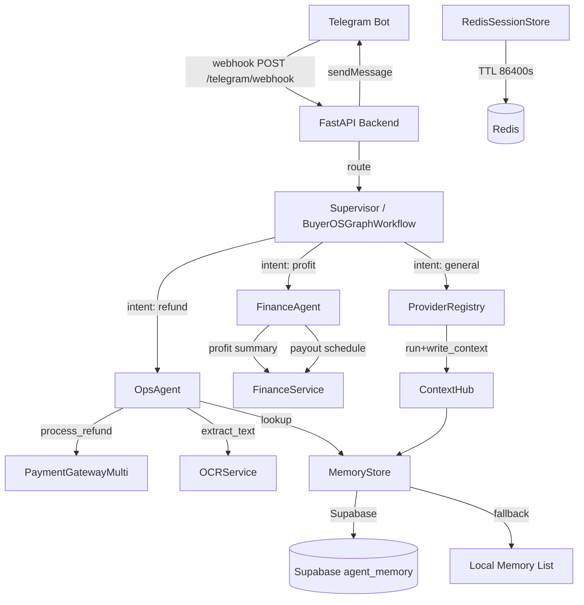

# BuyerOS Architecture

## System Overview

BuyerOS is a multi-agent backend for e-commerce operations and finance, organized around shared state (not agent group chat). Agents and external AI clients exchange context through `ContextHub`, which persists to Supabase when configured and falls back to local memory for tests and development.

## Architecture Diagram



## Core Agents

| Agent | Responsibility | Handles |
|---|---|---|
| `SupervisorAgent` | Keyword-based routing | refund → OpsAgent, profit → FinanceAgent |
| `BuyerOSGraphWorkflow` | LangGraph orchestrator (with deterministic fallback) | Same routing via `_classify()` |
| `OpsAgent` | Operations: refunds, OCR, orders | `refund`, `退款`, `ocr`, `文字識別`, `order`, `訂單` |
| `FinanceAgent` | Finance: profit, payout | `profit`, `盈利`, `payout`, `出糧`, `結算` |

## Data Flow

1. Telegram update arrives at `POST /telegram/webhook`
2. `workflow.handle_message()` extracts `user_id`, `message`, `channel`
3. `_classify()` sets `state["intent"]` via keyword matching
4. Appropriate agent is called; result written to `MemoryStore`
5. `workflow.handle_message()` returns `reply` string
6. Telegram `sendMessage` API sends `reply` back to user

## Provider Clients (11 Adapters)

All inherit from `BaseProviderAdapter`. Providers exchange context via `ContextHub` but do not chat with each other directly.

| Provider | Default OpenRouter Model | Env Override |
|---|---|---|
| `claude` | `anthropic/claude-sonnet-4.5` | `OPENROUTER_MODEL_CLAUDE` |
| `cursor` | `anthropic/claude-sonnet-4.5` | `OPENROUTER_MODEL_CURSOR` |
| `openai` | `openai/gpt-4o-mini` | `OPENROUTER_MODEL_OPENAI` |
| `openrouter` | `openai/gpt-4o-mini` | `OPENROUTER_MODEL_SUPERVISOR` |
| `gemini` | `google/gemini-pro-1.5` | `OPENROUTER_MODEL_GEMINI` |
| `deepseek` | `deepseek/deepseek-chat` | `OPENROUTER_MODEL_DEEPSEEK` |
| `minimax` | `minimax/minimax-01` | `OPENROUTER_MODEL_MINIMAX` |
| `grok` | `x-ai/grok-2` | `OPENROUTER_MODEL_GROK` |
| `perplexity` | `perplexity/sonar` | `OPENROUTER_MODEL_PERPLEXITY` |
| `hermes` | (stub) | — |
| `openclaw` | (local file scanner) | — |

## Shared Memory Namespaces

| Namespace | Written By | Content |
|---|---|---|
| `["buyeros", "refunds"]` | `OpsAgent` | Transaction ID → refund result |
| `["buyeros", "finance"]` | `FinanceAgent` | profit, payout responses |
| `["buyeros", "orders"]` | `OpsAgent` | Order details from e-commerce API |
| `["buyeros", "buyers"]` | `OpsAgent` | Buyer profile data |
| `["buyeros", "ai_context", <provider>]` | `ContextHub` | Per-provider AI context |
| `["buyeros", "audit"]` | `AuditLogger` | All action audit records |

## API Endpoints

| Method | Path | Auth | Purpose |
|---|---|---|---|
| `POST` | `/telegram/webhook` | Telegram secret | Telegram bot webhook |
| `GET` | `/ping` | None | Liveness |
| `GET` | `/health/ready` | None | Readiness (memory + Redis + providers) |
| `POST` | `/context/write` | `BUYEROS_API_KEY` | Write shared context |
| `POST` | `/context/search` | `BUYEROS_API_KEY` | Search context |
| `POST` | `/context/summarize` | `BUYEROS_API_KEY` | Summarize context |
| `GET` | `/context/session/{session_id}` | `BUYEROS_API_KEY` | Session context + Redis state |
| `POST` | `/agents/run` | `BUYEROS_API_KEY` | Run message through workflow |
| `GET` | `/providers` | `BUYEROS_API_KEY` | Provider status |
| `GET` | `/audit/search` | `BUYEROS_API_KEY` | Recent audit events |
| `GET` | `/system/capabilities` | `BUYEROS_API_KEY` | Full capability matrix |
| `POST` | `/automation/daily-report` | `BUYEROS_API_KEY` | Daily report snapshot |
| `POST` | `/automation/ocr-posting` | `BUYEROS_API_KEY` | OCR accounting entry |
| `POST` | `/automation/reconcile` | `BUYEROS_API_KEY` | Reconciliation + mismatch alert |
| `POST` | `/automation/alerts` | `BUYEROS_API_KEY` | Anomaly alert generation |
| `POST` | `/automation/approval` | `BUYEROS_API_KEY` | Manual approval task |
| `POST` | `/automation/retry` | `BUYEROS_API_KEY` | Retry state tracking |

## Storage Layers

- **Supabase (`agent_memory` table)**: Production persistent storage with GIN namespace index
- **Local list**: Development/test fallback, no persistence
- **Redis**: Session state with TTL 86400s; key pattern `buyeros:session:{id}:last_state`

## Payment Adapters

`PaymentGatewayMulti` routes to the first configured provider:

1. **Stripe** — `STRIPE_API_KEY` + `STRIPE_API_VERSION`; POSTs to `https://api.stripe.com/v1/refunds`
2. **PayPal** — `PAYPAL_CLIENT_ID` + `PAYPAL_CLIENT_SECRET` + `PAYPAL_MODE`; POSTs to PayPal Refund API
3. **Custom REST** — `PAYMENT_GATEWAY_BASE_URL` + `PAYMENT_GATEWAY_API_KEY`; fallback from original `PaymentGatewayClient`

## Finance Adapters

`FinanceService` routes to the first configured source:

1. **Google Sheets** — `GOOGLE_SHEETS_ID` + service account or API key; reads profit and payout sheets
2. **Remote Finance API** — `FINANCE_API_BASE_URL` + `FINANCE_API_KEY`
3. **Local estimate** — Falls back to refund count × 500 HKD (development only)

## E-Commerce Adapters

`OrdersService` and `BuyersService` route to the first configured source:

1. **Shopify** — `SHOPIFY_SHOP_DOMAIN` + `SHOPIFY_ACCESS_TOKEN`
2. **Custom REST** — `ORDERS_API_BASE_URL` / `BUYERS_API_BASE_URL` + API key

## Deployment Topology

- **Primary node**: `206.189.116.155` (4 vCPU / 8 GB RAM) — production BuyerOS, Redis, Telegram webhook, OpenRouter routing
- **Secondary node**: `167.172.60.38` (1 vCPU / 2 GB RAM) — staging, reverse proxy, monitoring relay

See `infra/deploy_vps.sh` for automated VPS deployment.

## Key Environment Variables

See `.env.example` for the full list. Critical variables:

```bash
# Core
BUYEROS_API_KEY=          # API authentication
SUPABASE_URL=             # Production memory store
SUPABASE_KEY=             # Supabase service role key
REDIS_URL=                # Session store
TELEGRAM_BOT_TOKEN=      # Telegram bot

# AI
OPENROUTER_API_KEY=      # AI routing (all providers)

# Business
STRIPE_API_KEY=          # Stripe refunds
PAYPAL_CLIENT_ID=        # PayPal refunds
GOOGLE_SHEETS_ID=        # Finance data
SHOPIFY_SHOP_DOMAIN=     # Order/buyer data
```
